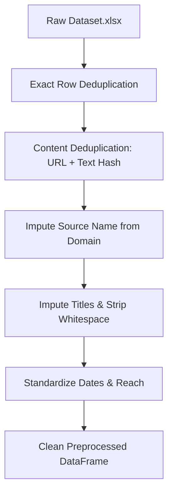
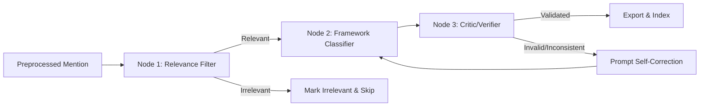
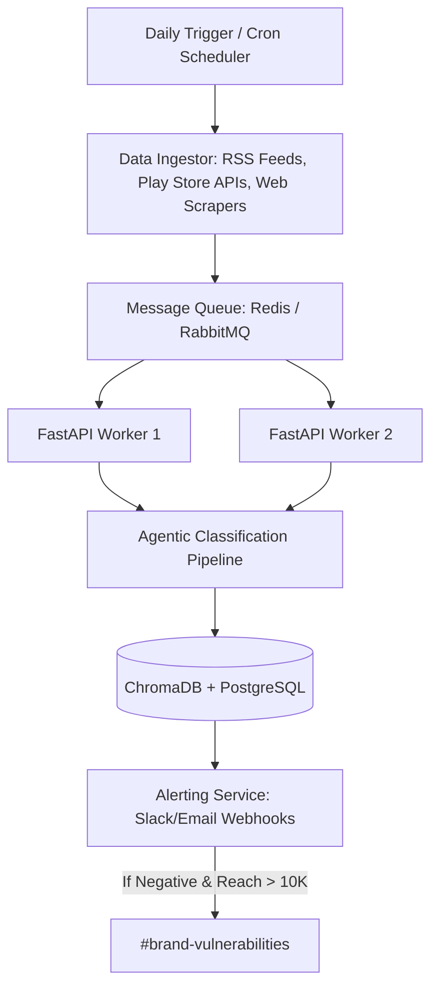

# Brand Reputation Intelligence System: Methodology & Scalability Report
**Client**: ICICI Prudential AMC  
**Consulting Advisor**: Eminence Strategy Consulting

---

## Executive Summary
This report details the technical methodology, AI agent design, and scalability architecture implemented to analyze digital mentions for **ICICI Prudential Asset Management Company (AMC)**. 

Brand reputation in the BFSI sector is highly dynamic, where a single app crash review or complaint about slow redemption can spiral if left unaddressed. By transforming messy digital mention data into structured reputation parameters (Sentiment, Driver, Sub-driver), this system enables strategic consultants and brand managers to monitor brand health, isolate friction points, and respond to high-risk issues in near real-time.

---

## 1. Data Intelligence & Processing Methodology

To ensure clean, high-fidelity analytics, a rigorous programmatic data preparation pipeline was constructed prior to classification:

### 1.1 Data Cleansing Steps
1. **Deduplication**: 
   * **Exact Deduplication**: Dropped completely identical row entries.
   * **Content-level Deduplication**: Extracted a hash key based on `URL` and `Opening Text` to filter out duplicate syndications (same article published across different URLs or duplicate app reviews).
2. **Missing Value Imputation**:
   * **Source Name**: If blank, the system dynamically parsed the domain name from the `URL` (e.g. mapping `play.google.com` to `Google Play Store`, extracting domain names, and standardizing them to Title Case).
   * **Title**: Missing titles were dynamically generated using the first 50 characters of the `Opening Text` appended with an ellipsis (`...`). For Google Play Store reviews, the title was set to `"Google Play Store Review"`.
   * **Reach**: Missing reach values were filled with `0` (conservative estimate) and standardized to float formats.
3. **Sentiment Normalization**: Mixed casing (e.g. `positive`, `neutral`, `Negative`) was cleaned and mapped into three standardized categories: `Positive`, `Neutral`, and `Negative`.

---

## 2. 3-Node Agentic Classification Architecture

Unlike a basic linear API call that often fails to maintain category consistency, this system utilizes an **Agentic Design Pattern** written using the OpenAI SDK and Pydantic. It contains three cooperative agent nodes:

### Node 1: Relevance Filter
* **Role**: Evaluates if the mention is actually relevant to ICICI Prudential Mutual Fund / AMC.
* **Logic**: Separates corporate or mutual fund discussions from general banking mentions (e.g. unrelated ICICI Bank credit card complaints or general Prudential Plc global news) to keep the database free of noise.
* **Result**: Out of 85 unique deduplicated mentions from the raw dataset, Node 1 successfully identified **65 relevant entries** and filtered out **20 irrelevant records** (such as generic market noise and unrelated banking spam).

### Node 2: Framework Classifier
* **Role**: Map mentions to the client's official framework (3 drivers, 8 sub-drivers) and sentiment.
* **Constraint Enforcement**: Uses OpenAI's **Structured Outputs API** (`client.beta.chat.completions.parse()`) backed by a strict Pydantic JSON Schema, guaranteeing that the model only outputs permitted categories:
  * **Brand Perception**: *Thought Leadership*, *Product Strategy*, *Brand Visibility & Marketing*
  * **User Experience**: *Product & Service Quality*, *Customer Support & Complaint Resolution*, *Digital & Omnichannel Experience*
  * **Responsible Business Practices**: *Regulatory Compliance & Ethical Governance*, *Social Impact & Community (CSR)*
  * **Sentiment**: *Positive*, *Neutral*, *Negative*

### Node 3: Critic / Verifier (Self-Correction Loop)
* **Role**: Evaluates the output of Node 2 before saving.
* **Validation Checks**:
  1. Checks if the sub-driver is actually a child of the selected driver (e.g. rejects "Thought Leadership" under "User Experience").
  2. Evaluates domain constraints: if the text describes a mobile app crash, it verifies that the category is mapped to `Digital & Omnichannel Experience`.
* **Self-Correction**: If a check fails, the critic generates a natural language feedback prompt describing the violation and sends it back to Node 2 for re-evaluation. The pipeline allows up to 2 retries to correct itself.

---

## 3. Vector Database & Semantic Retrieval (ChromaDB)

A core requirement of reputation intelligence is the ability to search by concepts (e.g. "complaints about UI transactions") rather than just literal keyword matching:
* **Embeddings**: Generated using OpenAI's state-of-the-art `text-embedding-3-small` (1536 dimensions), which offers high performance at a lower cost.
* **Vector Store**: Clean records are indexed in **ChromaDB**, an open-source, highly portable vector database configured with **Cosine Similarity** (`hnsw:space = cosine`).
* **Semantic Querying**: Query inputs are embedded on-the-fly, allowing the Content Explorer to return conceptually relevant mentions ranked by similarity score, with metadata filtering for sentiment and driver.

---

## 4. Daily Automated Pipeline Architecture

To transition this system into a daily automated monitor, we propose the following enterprise architecture:

### 4.1 Daily Workflow Components:
1. **Daily Trigger**: A scheduling cron (e.g. GitHub Actions, AWS EventBridge, or Airflow) fires every morning at 6:00 AM.
2. **Ingestion Pipelines**: Scrapers and API clients gather new digital mentions from target sources (Google Play Store reviews, RSS news feeds, Twitter, financial forums).
3. **Task Queue**: Incoming raw mentions are pushed to a Redis-backed **Celery** queue to handle rate limits and concurrency.
4. **Worker Nodes**: Parallel FastAPI backend workers pull tasks, execute data cleaning, run the 3-node agentic classifier, and generate embeddings.
5. **Database Upserts**: Classifications are written to a primary relational database (for structured SQL queries), and vectors are added to ChromaDB.
6. **Real-time Alerting**: If a mention is classified as **Negative** with an estimated **Reach > 10,000**, the alerting service triggers a webhook pushing a warning to a Microsoft Teams or Slack channel (`#brand-vulnerabilities`), allowing the PR team to respond within minutes.

### 4.2 Scalability & Cost-Saving Optimizations:
* **Batch Embeddings**: Call the OpenAI Embedding API with batches of up to 2,048 texts at once to minimize network roundtrips.
* **Vector Index Partitioning**: As index size grows to millions of documents, partition ChromaDB collections by month or target brand to maintain sub-10ms search latencies.
* **LLM Cache**: Implement semantic caching (e.g., GPTCache) to avoid calling the LLM for identical user complaints or duplicate news articles.
